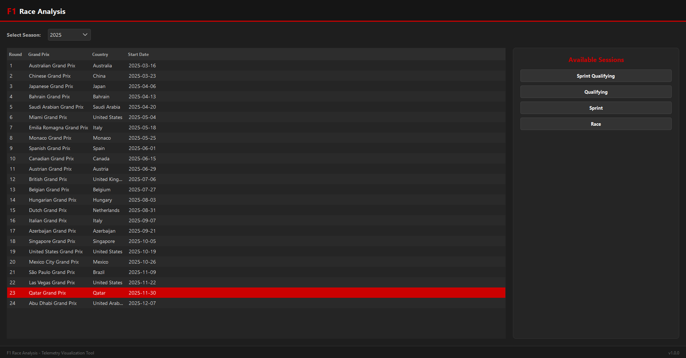
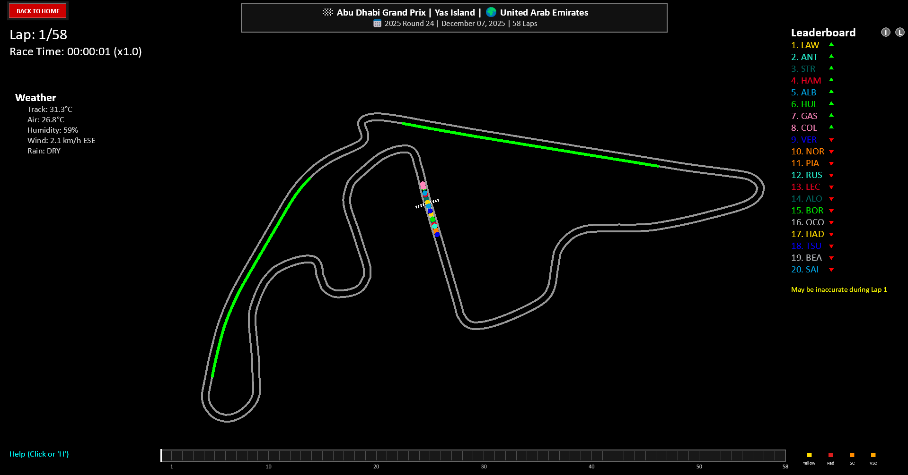
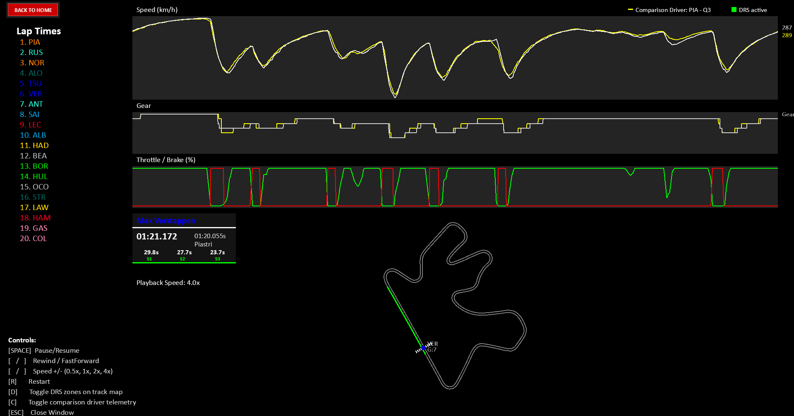

# F1 Race Analysis

A Python application for visualizing Formula 1 sessions using real telemetry data. 
The app provides a desktop GUI to select seasons, race weekends, and sessions, then launches an animated replay with interactive playback controls and driver telemetry overlays.

---

##  Screenshots

### Home Screen


---

### Race Analysis


---

### Driver Telemetry Overlay


---

##  Features

- **Animated race replays** using real F1 telemetry data  
- **Desktop GUI** for selecting seasons, races, and sessions  
- **Live leaderboard** with tyre compounds and driver status  
- **Lap and time tracking** throughout the session  
- **Driver telemetry overlays** including speed, gear, and DRS status  
- **Interactive playback controls** via keyboard and on-screen buttons  
- **On-screen legend** explaining all controls  

---

##  Controls

| Action | Key |
|------|----|
| Pause / Resume | `Space` |
| Rewind / Fast Forward | `←` / `→` |
| Change Playback Speed | `↑` / `↓` |
| Set Speed Directly | `1`–`4` |
| Restart Replay | `R` |
| Toggle DRS Zones | `D` |
| Toggle Progress Bar | `B` |
| Toggle Driver Labels | `L` |
| Select Drivers | Click / `Shift + Click` |

---

##  Session Support

- **Race**
- **Qualifying**
- **Sprint**
- **Sprint Qualifying** (if available for the event)

Qualifying replays include lap based telemetry such as speed, gear, throttle, and brake data.  

---

##  Technologies Used

- **Python 3.11+**
- **FastF1** for official telemetry and timing data  
- **PySide6 (Qt)** for the desktop GUI  
- **Arcade / Pyglet** for animated race visualization  
- **NumPy** for numerical processing  

---

##  How to Run

Clone the repo:
```bash
git clone https://github.com/SammyBolger/f1-race-replay.git
cd f1-race-replay
```

Install dependencies:
```bash
pip install -r requirements.txt
```

Run the application:
```bash
python main.py
```

FastF1 will automatically create a cache folder on first run. If it does not, manually create a folder named .fastf1-cache in the project root.

---

## Acknowledgements

This project is based on the original F1 Race Replay project created by Tom Shaw, This version builds on that foundation with additional UI, UX, and application flow improvements.

---

 ## Future Work

- **Improve leaderboard accuracy** during pit cycles and race start
- **Expand qualifying and sprint** session visualizations
- **Add additional telemetry overlays** and driver comparison tools
- **Explore exporting replays** or telemetry summaries

---

## Data

[Fast F1](https://github.com/theOehrly/Fast-F1), all F1 data somes from this repo

---

## Contact

- **LinkedIn:** [Sam Bolger](https://www.linkedin.com/in/sambolger/)
- **Email:** sbolger@cord.edu
- **Portfolio:** [sammybolger.com](http://www.sammybolger.com/)
